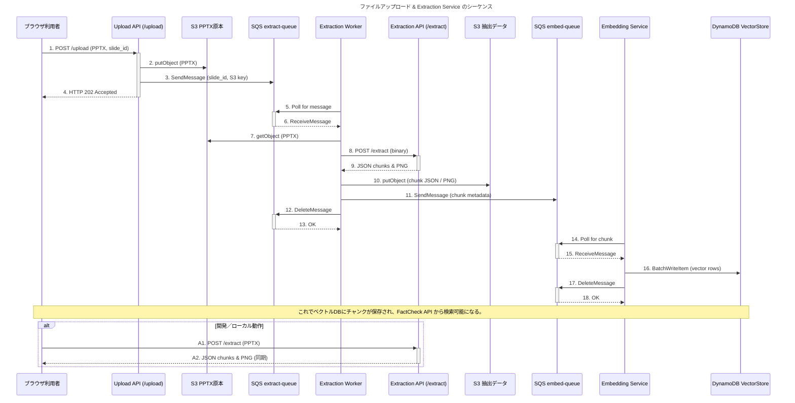
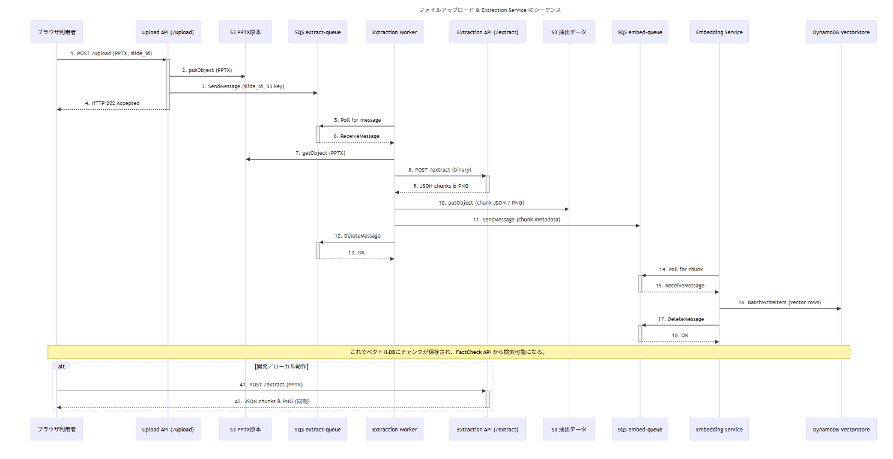
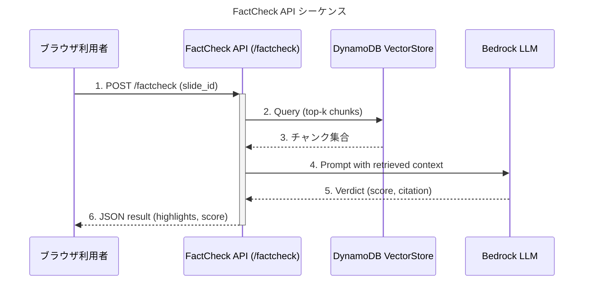
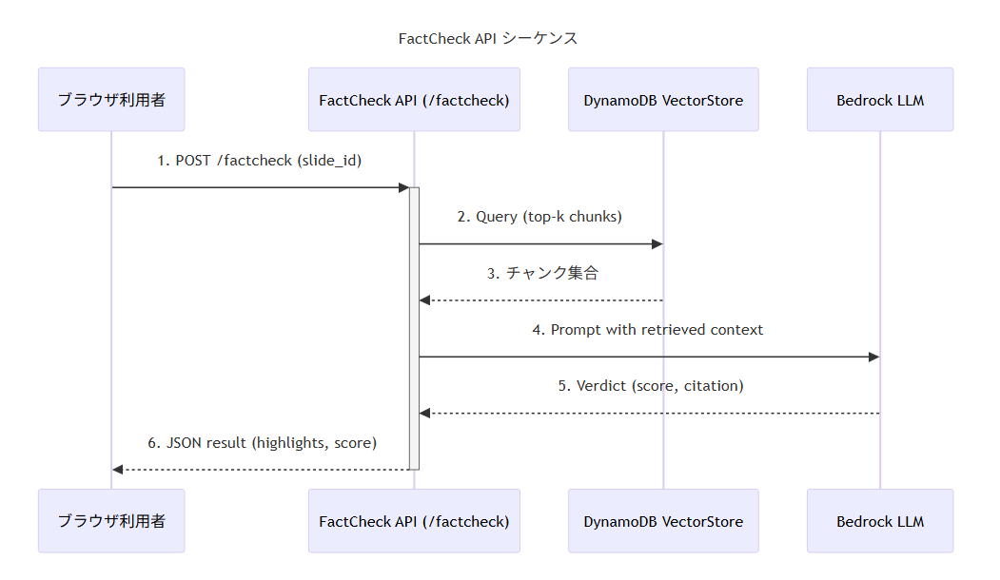

# Sequence Diagram – Upload & Extraction (v1 scope)

> **ポイント**
>
> * **Upload API** と **Extraction API** の両方を明示。開発環境では Extraction API に直接 POST して抽出を確認できます。
> * 本番では Upload API ➜ S3 ➜ SQS ➜ Extraction Worker の非同期ルートを使用します。
> * Embedding Service まで含め、ベクトルが DynamoDB に保存されるところまで記載しています。

---

## Sequence Diagram – FactCheck (v1 scope)

