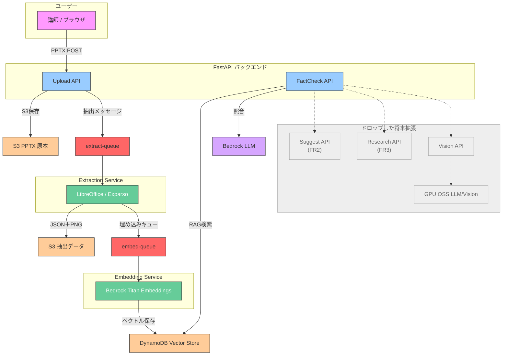

# System Diagram – **Fact‑Check v1 Scope**

> **v0.9 → v1.0 スコープ整理**
> FR2（質問サジェスト）・FR3（SNS リサーチ）など **ドロップ**。Box を *薄グレー* にして将来拡張として残しています。

---

## テキスト説明

| # | 処理                           | 主要サービス                         | 備考                            |
| - | ---------------------------- | ------------------------------ | ----------------------------- |
| 1 | スライド PPTX をアップロード            | **UploadAPI** (FastAPI)        | presigned URL 予定              |
| 2 | S3 に保存 & SQS 抽出キューの予定だったがAPIで直接呼出しに変更          | UploadAPI → S3Raw / SQSExtract | LocalStack で再現                |
| 3 | LibreOffice + Exparso でページ抽出 | Extraction Service             | JSON（テキスト）+ PNG を生成           |
| 4 | 埋め込み要求を SQS へ                | Extractor → SQSEmbed           |                               |
| 5 | Titan Embeddings でベクトル化      | Embedding Service              | DynamoDB VectorStore に upsert |
| 6 | ベクトル検索 (RAG)                 | FactCheckAPI                   | slide\_id + chunk で検索         |
| 7 | Bedrock LLM で真偽判定            | FactCheckAPI → Bedrock LLM     | スコア＋ハイライト返却                   |

> **グレーの Box** は *将来スコープ*（FR2, FR3, Vision, OSS GPU スタック）。
> v1.0 ではルートに含まず、コードもコメントアウト中です。

---

### 更新履歴

* **2025-06-20**: Fact‑Check 専用図に簡素化。FR2〜FR3 などはドロップ扱いとしてグレー表示 (by scope freeze)
